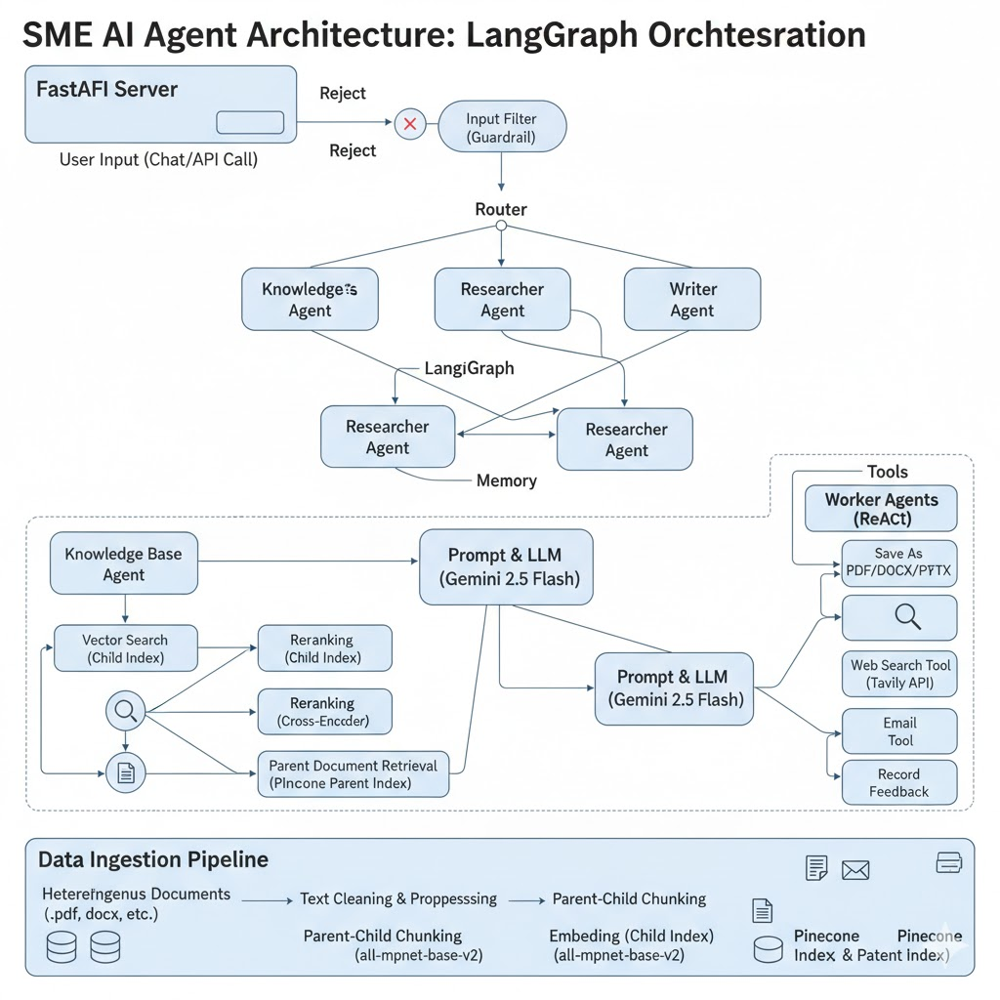

# Final Project Report: Subject Matter Expert (SME) AI Agent

**Domain:** Engineering (Data Science & Machine Learning)
**Course:** Large Model Applications (LMA)
**Contributors:** Arya Topale(2022102052) and Prakhar Jain(2022115006)

## 1. Project Overview and Objective

This project successfully implemented a highly extensible **Retrieval-Augmented Generation (RAG) system** capable of serving as a Subject Matter Expert (SME) in **Data Science and Machine Learning**.

The SME agent's role is to aid in technical problem-solving, provide robust question-answering on core concepts, and facilitate the generation of learning materials.

### Project Scope and Corpus
The core knowledge base consists of lecture notes, section notes, and supplementary materials from the **Stanford CS229 Machine Learning course**, chosen for its comprehensive and authoritative nature. The system supports heterogeneous document formats including `.pdf`, `.docx`, `.pptx`, `.txt`, and `.md`.

---

## 2. Core System Architecture: Multi-Agent Workflow

The system employs a multi-agent architecture orchestrated by **LangGraph** (implemented in `planning/conversational_agent_graph.py`) to manage complex, multi-step user requests.

### A. Architecture Diagram
Here's a visual representation of the SME Agent's architecture:

<!-- http://googleusercontent.com/image_generation_content/0 -->

### B. Orchestration Layer
The core flow is managed by three key nodes:

1.  **Input Filter (Guardrail):** Serves as the initial guardrail, classifying the user's message as:
    * `Router` (for domain-specific tasks, including generation/saving)
    * `GeneralChat` (for greetings/feedback)
    * `Reject` (for off-topic questions).
2.  **Router:** A specialized LLM endpoint that, for domain-specific tasks, routes the request to the appropriate specialist agent (`KnowledgeBase`, `Researcher`, or `Writer`).
3.  **State Management:** The system uses `GraphState` and a `MemorySaver` to maintain the **conversational context** and message history across different agent transitions.

### C. Worker Agents and Specialization

| Agent Name | Primary Tool(s) | Role and Rationale |
| :--- | :--- | :--- |
| **KnowledgeBase** | `knowledge_base_tool`, `assignment_generator_tool` | The primary RAG agent, focused on answering specific questions and generating content (e.g., quizzes, study guides) from the internal data corpus. |
| **Researcher** | `web_search_tool` (Tavily) | Provides **fresh information** and external context to address topics not covered in the static knowledge base. |
| **Writer** | All document and email tools | Specializes in taking generated content from the chat history and performing actionable tasks: saving to a file or sending an email. |
| **GeneralChat** | `Record Feedback` | Handles casual chat and explicitly calls the `FeedbackTool` to log user satisfaction and suggestions, contributing to system adaptation. |

---

## 3. Data Pipeline and Advanced RAG Techniques

The Retrieval-Augmented Generation (RAG) pipeline is designed for maximum relevance and context breadth.

### A. Data Preparation and Chunking
The preprocessing and indexing logic is contained within `preprocessing/chunking_2.py` and `indexing/index.py`.

* **Data Ingestion and Cleaning:** A custom `clean_text` function handles common issues in raw document parsing, such as normalizing ligatures, de-hyphenating words across lines, and standardizing whitespace, critical for maintaining semantic continuity.
* **Parent-Child Chunking Strategy:** To facilitate hierarchical retrieval, documents are split at multiple granularities:
    * **Parent Chunks:** Large chunks (e.g., 2000 characters) for rich context.
    * **Child Chunks:** Small, semantically precise chunks (e.g., 500 characters) for high-relevance search.
* **Indexing with Dual-Stores:** **Pinecone** is used with two dedicated indexes (`sme-agent-child-chunks` and `sme-agent-parent-chunks`). Child chunks are indexed with their embedding for search, while the larger parent chunks are stored and fetched via ID (using the `parent_id` metadata field) to provide the full context to the LLM.

### B. Retrieval and Relevance Ranking
The retrieval mechanism (implemented in the `_retrieve_and_rerank` method in `rag_api/sme_agent.py`) incorporates reranking for improved precision.

* **Embedding Model:** **Sentence-Transformers' `all-mpnet-base-v2`** model generates the 768-dimensional embeddings.
* **Reranking Technique:** The system initially retrieves a higher number of candidates (e.g., top 20 child chunks). These candidate documents are then passed to a **Cross-Encoder model** (`BAAI/bge-reranker-base`) which re-scores the passage-query pairs.
* **Context Selection:** Only the **top 3** reranked parent documents are selected and compiled as the final context passed to the generative LLM prompt. This addresses the project requirement for a reranking step.
* **Fallback Mechanism:** A `try...except` block ensures that if the reranking step fails, the system falls back to using the initial similarity search results to maintain robustness.

---

## 4. Tooling and Actionable Capabilities

The system's core requirements include document generation and email automation. This is achieved through a set of custom **BaseTool** classes defined in `rag_api/sme_agent.py`.

| Tool Name | Core Functionality | Implementation Libraries |
| :--- | :--- | :--- |
| **`Save As PDF`** | Converts text to PDF. | `reportlab.platypus`, `markdown` (for basic formatting). |
| **`Save As DOCX`** | Converts text to DOCX. | `docx` library. |
| **`Save As PPTX`** | Converts text to presentation slides, splitting content based on markdown headings (`#`, `##`). | `pptx` library. |
| **`Send Email`** | Sends a custom email with an optional file attachment (from the `generated_documents` directory). | Standard `smtplib` and `email.message` libraries. |
| **`Record Feedback`** | Logs user ratings and new information sources to a persistent `feedback_log.jsonl` file. | Standard Python file I/O and `json`. |

**API Integration for Downloads (FastAPI Fix):**
The `server/server.py` implementation uses **FastAPI** to serve the application and includes a robust mechanism for handling file downloads:
* The output of a "Save As" tool is a JSON string containing the relative path to the generated file.
* The API server uses a regular expression to extract this JSON or the file path from the agent's final output.
* The server then mounts the `generated_documents` directory using `StaticFiles`, making the files accessible via a direct URL and triggering the download client-side.

---

## 5. Technology Stack and Libraries

| Category | Library/Framework | Role in Project |
| :--- | :--- | :--- |
| **LLM Provider** | `langchain_google_genai` (Gemini 2.5-flash) | Generative engine for reasoning, routing, and content creation. |
| **Orchestration** | `langgraph` | State machine for managing complex, multi-agent conversational flow. |
| **Agent Framework** | `langchain_classic` | Used for `AgentExecutor` and `create_react_agent`. |
| **Vector DB** | `pinecone` | Dual-index storage for efficient RAG retrieval. |
| **Embeddings** | `sentence-transformers` | Generating semantic vectors for documents and queries. |
| **Reranking** | `CrossEncoder` (`BAAI/bge-reranker-base`) | Post-retrieval ranking of context chunks. |
| **Web Search** | `langchain_tavily` | External tool for the Researcher Agent. |
| **API Server** | `fastapi`, `uvicorn` | High-performance backend server and asynchronous request handling. |
| **Document Parsing** | `pypdf`, `docx`, `pptx` | Extracting content from heterogeneous files. |
| **Document Generation** | `reportlab`, `python-docx`, `python-pptx` | Creating final user-ready files (PDF, DOCX, PPTX). |

---

## 6. Conclusion and Key Achievements

The project successfully delivered a complete, end-to-end SME solution, fulfilling all major requirements and implementing several recommended bonuses:

| Project Requirement | Implementation Status | Related Files/Technique |
| :--- | :--- | :--- |
| **Agentic Workflow** | **Completed** | LangGraph orchestration with four specialized agents. |
| **RAG-based Q&A** | **Completed** | Parent-Child Chunking with Dual-Index Pinecone setup. |
| **Hybrid Retrieval** | **Implemented** | Vector Search combined with Cross-Encoder Reranking. |
| **Document Generation** | **Completed** | Custom `SaveAs` tools for PDF, DOCX, PPTX formats. |
| **Email Automation** | **Completed** | `EmailTool` capable of attaching generated documents. |
| **Input/Output Guardrails** | **Implemented** | Initial Input Filter node for topic triage and rejection. |
| **Self-Learning/Adaptation** | **Implemented** | `FeedbackTool` logs data for future model/content refinement. |
| **Data Ingestion Pipeline** | **Implemented** | `Knowledge Base Tool` correctly only gets cleaned data and processed data, and logs errors if needed. |

## Demo Video
The following link contains the link to the demo video:
[Demo Video Link](https://drive.google.com/drive/folders/10WvkHiY_jOe5_8mpCcvdvXw8JP7seQ1-?usp=share_link)
